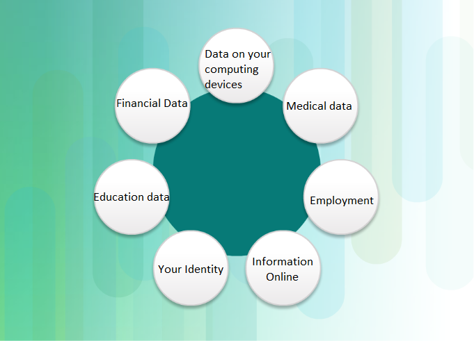

# **Basics of Cybersecurity by Cisco** 

## **Introduction**

### The Need for Cybersecurity

The connected electronic information network has become an integral part of our daily lives. 
All types of organizations, such as medical, financial, and education institutions, 
use this network to operate effectively. 
They utilize the network by collecting, processing, storing, and sharing vast amounts of digital information.
As more digital information is gathered and shared, the protection of this information is becoming 
even more vital to our national security and economic stability.
Cybersecurity is the ongoing effort to protect these networked systems and all
of the data from unauthorized use or harm. 
On a personal level, you need to safeguard your identity, your data, and your computing devices. 
At the corporate level, it is everyone’s responsibility to protect the organization’s reputation, 
data, and customers. 
At the state level, national security, and the safety and well-being of the citizens are at stake.

### Offline and online identity

As more time is spent online, your identity, both online and offline, can affect your life. 
Your offline identity is the person who your friends and family interact with on a daily basis at home, 
at school, or work. They know your personal information, such as your name, age, or where you live. 
Your online identity is who you are in cyberspace. 
Your online identity is how you present yourself to others online. 
This online identity should only reveal a limited amount of information about you.
You should take care when choosing a username or alias for your online identity. 
The username should not include any personal information. 
It should be something appropriate and respectful. 
This username should not lead strangers to think you are an easy target for cybercrimes or unwanted attention.

### Your Data

Any information about you can be considered to be your data. 
This personal information can uniquely identify you as an individual. 
This data includes the pictures and messages that you exchange with your family and friends online. 
Other information, such as name, social security number, date and place of birth, or mother‘s maiden name, 
is known by you and used to identify you. Information such as medical, educational, financial, 
and employment information, can also be used to identify you online.

* **Medical records.**  
Every time you go to the doctor’s office, more information is added to your electronic health records (EHRs). |
The prescription from your family doctor becomes part of your EHR. Your EHR includes your physical health,    |
mental health, and other personal information that may not be medically-related. For example,                 |  
if you had counseling as a child when there were major changes in the family,                                 |
this will be somewhere in your medical records.                                                               |
Besides your medical history and personal information, the EHR may also include information about your family.|
Medical devices, such as fitness bands, use the cloud platform to enable wireless transfer,                   |
storage and display of clinical data like heart rates, blood pressures and blood sugars.                      |
These devices can generate an enormous amount of clinical data that could become part of your medical records.|

* **Education Records.**    
As you progress through your education, information about your grades and test scores, your attendance, 
courses taken, awards and degrees rewarded, and any disciplinary reports may be in your education record.
This record may also include contact information, health and immunization records, and special education 
records including individualized education programs (IEPs).

* **Employment and Financial Records.**    
Your financial record may include information about your income and expenditures. 
Tax records could include paycheck stubs, credit card statements, your credit rating and other 
banking information. Your employment information can include your past employment and your performance.

### Where is your data

All of this information is about you. There are different laws that protect your privacy 
and data in your country. But do you know where your data is?
When you are at the doctor’s office, the conversation you have with the doctor 
is recorded in your medical chart. 
For billing purposes, this information may be shared with the insurance company to ensure 
appropriate billing and quality. Now, a part of your medical record for the visit is also at the insurance company. The store loyalty cards maybe a convenient way to save money for your purchases. 
However, the store is compiling a profile of your purchases and using that information for its own use. 
The profile shows a buyer purchases a certain brand and flavor of toothpaste regularly. 
The store uses this information to target the buyer with special offers from the marketing partner. 
By using the loyalty card, the store and the marketing partner have a profile for the purchasing 
behavior of a customer.
When you share your pictures online with your friends, do you know who may have a copy of the pictures? 
Copies of the pictures are on your own devices. Your friends may have copies of those pictures downloaded onto their devices. If the pictures are shared publicly, strangers may have copies of them, too. 
They could download those pictures or take screenshots of those pictures. 
Because the pictures were posted online, they are also saved on servers located in different 
parts of the world. Now the pictures are no longer only found on your computing devices.

### Your Computing Devices

Your computing devices do not just store your data.  Now  these devices have become the portal to your data and generate information about you. Unless you have chosen to receive paper statements for all  of your accounts, you use your computing devices to access the data. If  you want a digital copy of the most recent credit card statement, you  use your computing devices to access the website of the credit card  issuer. If you want to pay your credit card bill online, you access the  website of your bank to transfer the funds using your computing devices. Besides allowing you to access your information, the computing devices  can also generate information about you. With all this information about you available online,             your personal data has become profitable to hackers.

### They Want Your Money

If you have anything of value, the criminals want it. Your online credentials are valuable. These credentials  give the thieves access to your accounts. You may think the frequent flyer miles you have earned are not valuable to cybercriminals. Think again. After approximately 10,000 American Airlines and United accounts  were hacked, cybercriminals booked free flights and upgrades using these stolen credentials. Even though the frequent flyer miles were returned  to the customers by the airlines, this demonstrates the value of login  credentials. A criminal could also take advantage of your relationships. They could access your online accounts and your reputation to trick you into wiring money to your friends or family. The criminal can send messages stating that your family or friends need you to wire them money so they can get home from abroad after losing their wallets. The criminals are very imaginative when they are trying to  trick you into giving them money. They do not just steal your money; they could also steal your identity and ruin your life, we will talk about it next.

### They Want Your Identity

Besides stealing your money for a short-term monetary gain, the criminals want long-term profits by stealing your identity. As medical costs rise, medical identity theft is also on the rise. The identity thieves can steal your medical insurance and use your medical  benefits for themselves, and these medical procedures are now in your medical records. The annual tax filing procedures may vary from country to country;  however, cybercriminals see this time as an opportunity. For example,  the people of the United States need to file their taxes by April 15 of  each year. The Internal Revenue Service (IRS) does not check the tax  return against the information from the employer until July. An identity thief can file a fake tax return and collect the refund. The legitimate filers will notice when their returns are rejected by IRS. With the  stolen identity, they can also open credit card accounts and run up  debts in your name. This will cause damage to your credit rating and  make it more difficult for you to obtain loans. Personal credentials can also lead to corporate data and government data access. 

### Types of Organizational Data

* **Traditional Data.**                            
Corporate data includes personnel information, intellectual properties,  and financial data. The personnel information includes application  materials, payroll, offer letters, employee agreements, and any  information used in making employment decisions. Intellectual property,  such as patents, trademarks and new product plans, allows a business to  gain economic advantage over its competitors. This intellectual property can be considered a trade secret; losing this information can be  disastrous for the future of the company. The financial data, such as  income statements, balance sheets, and cash flow statements of a company gives insight into the health of the company.

* **Internet of Things and Big Data.**                     
With the emergence of the Internet of Things (IoT), there is a lot more  data to manage and secure. IoT is a large network of physical objects,  such as sensors and equipment that extend beyond the traditional  computer network. All these connections, plus the fact that we have  expanded storage capacity and storage services through the cloud and  virtualization, lead to the exponential growth of data. This data has  created a new area of interest in technology and business called “Big  Data". With the velocity, volume, and variety of data generated by the  IoT and the daily operations of business, the confidentiality, integrity and availability of this data is vital to the survival of the  organization.