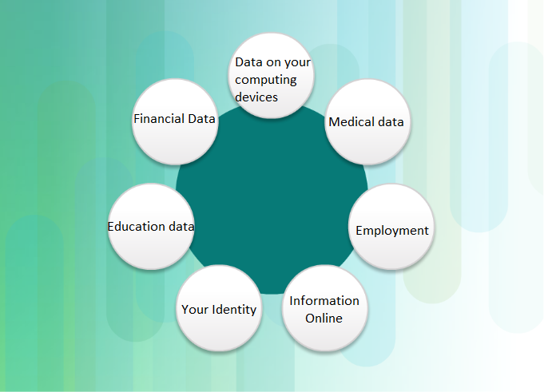
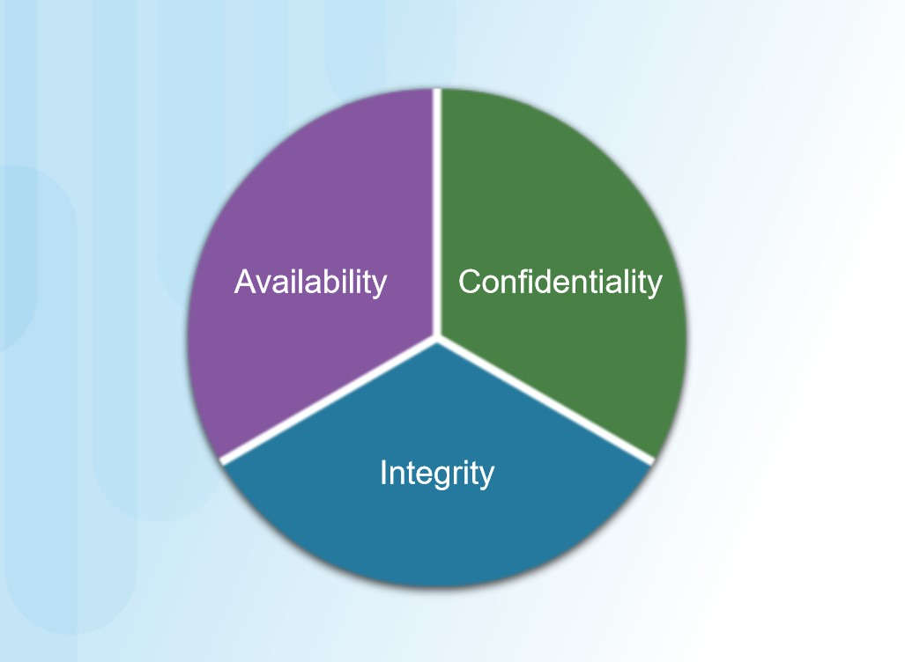
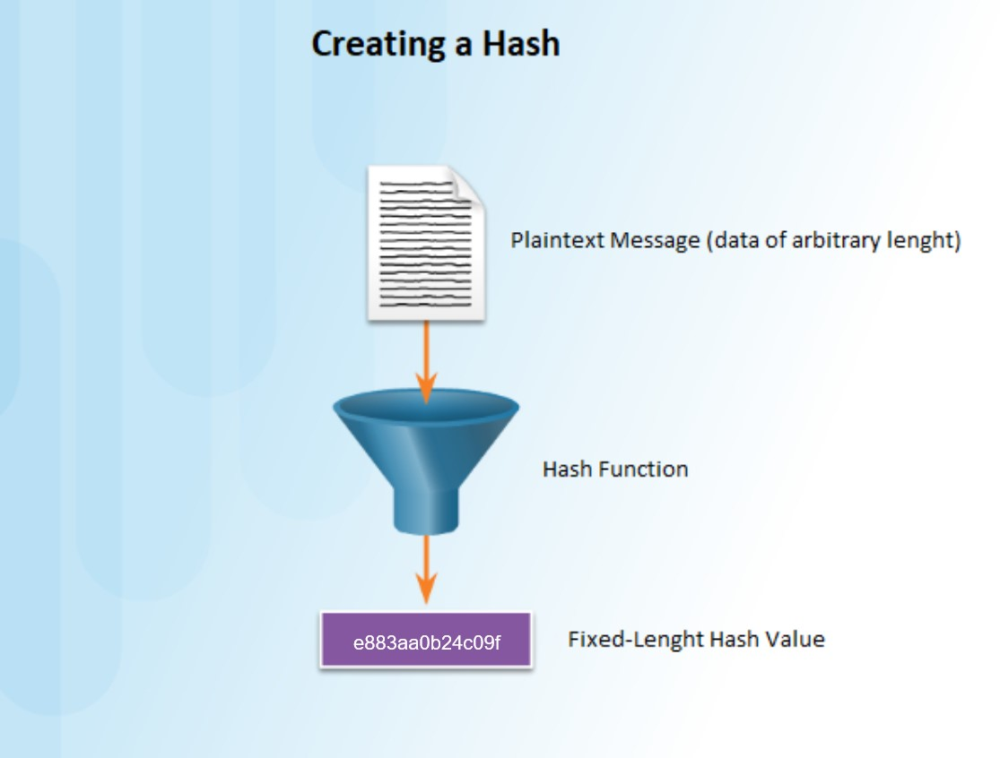
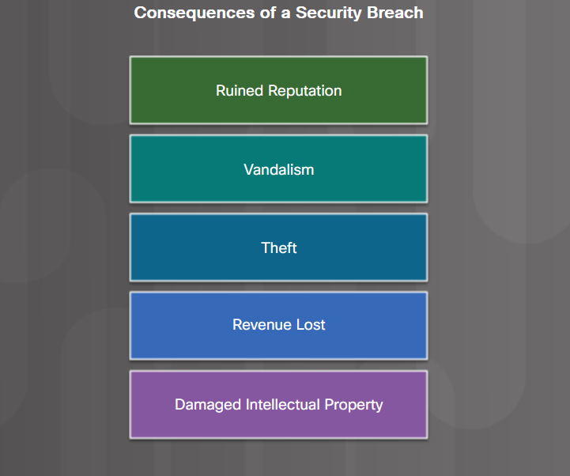
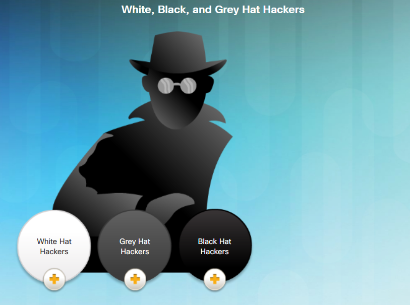
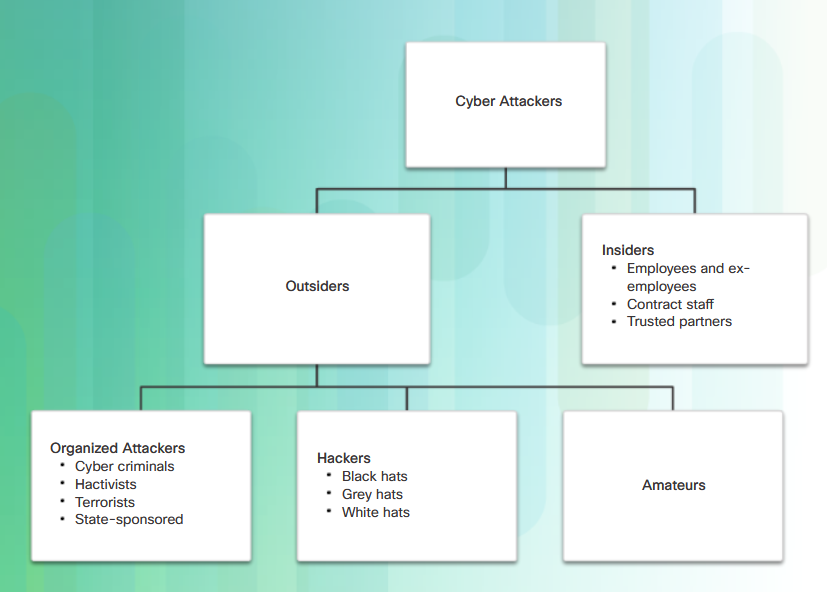

# **Basics of Cybersecurity by Cisco** 
## **First chapter**
## **Introduction**

### The Need for Cybersecurity

The connected electronic information network has become an integral part of our daily lives. 
All types of organizations, such as medical, financial, and education institutions, 
use this network to operate effectively. 
They utilize the network by collecting, processing, storing, and sharing vast amounts of digital information.
As more digital information is gathered and shared, the protection of this information is becoming 
even more vital to our national security and economic stability.
Cybersecurity is the ongoing effort to protect these networked systems and all
of the data from unauthorized use or harm. 
On a personal level, you need to safeguard your identity, your data, and your computing devices. 
At the corporate level, it is everyone’s responsibility to protect the organization’s reputation, 
data, and customers. 
At the state level, national security, and the safety and well-being of the citizens are at stake.

### Offline and online identity

As more time is spent online, your identity, both online and offline, can affect your life. 
Your offline identity is the person who your friends and family interact with on a daily basis at home, 
at school, or work. They know your personal information, such as your name, age, or where you live. 
Your online identity is who you are in cyberspace. 
Your online identity is how you present yourself to others online. 
This online identity should only reveal a limited amount of information about you.
You should take care when choosing a username or alias for your online identity. 
The username should not include any personal information. 
It should be something appropriate and respectful. 
This username should not lead strangers to think you are an easy target for cybercrimes or unwanted attention.

### Your Data

Any information about you can be considered to be your data. 
This personal information can uniquely identify you as an individual. 
This data includes the pictures and messages that you exchange with your family and friends online. 
Other information, such as name, social security number, date and place of birth, or mother‘s maiden name, 
is known by you and used to identify you. Information such as medical, educational, financial, 
and employment information, can also be used to identify you online.

* **Medical records.**  
Every time you go to the doctor’s office, more information is added to your electronic health records (EHRs).
The prescription from your family doctor becomes part of your EHR. Your EHR includes your physical health,
mental health, and other personal information that may not be medically-related. For example,     
if you had counseling as a child when there were major changes in the family,                                 
this will be somewhere in your medical records.
Besides your medical history and personal information, the EHR may also include information about your family.
Medical devices, such as fitness bands, use the cloud platform to enable wireless transfer,
storage and display of clinical data like heart rates, blood pressures and blood sugars.
These devices can generate an enormous amount of clinical data that could become part of your medical records.

* **Education Records.**    
As you progress through your education, information about your grades and test scores, your attendance, 
courses taken, awards and degrees rewarded, and any disciplinary reports may be in your education record.
This record may also include contact information, health and immunization records, and special education 
records including individualized education programs (IEPs).

* **Employment and Financial Records.**    
Your financial record may include information about your income and expenditures. 
Tax records could include paycheck stubs, credit card statements, your credit rating and other 
banking information. Your employment information can include your past employment and your performance.

### Where is your data

All of this information is about you. There are different laws that protect your privacy 
and data in your country. But do you know where your data is?
When you are at the doctor’s office, the conversation you have with the doctor 
is recorded in your medical chart. 
For billing purposes, this information may be shared with the insurance company to ensure 
appropriate billing and quality. Now, a part of your medical record for the visit is also at the insurance company. 
The store loyalty cards maybe a convenient way to save money for your purchases. 
However, the store is compiling a profile of your purchases and using that information for its own use. 
The profile shows a buyer purchases a certain brand and flavor of toothpaste regularly. 
The store uses this information to target the buyer with special offers from the marketing partner. 
By using the loyalty card, the store and the marketing partner have a profile for the purchasing 
behavior of a customer.
When you share your pictures online with your friends, do you know who may have a copy of the pictures? 
Copies of the pictures are on your own devices. 
Your friends may have copies of those pictures downloaded onto their devices. If the pictures are shared 
publicly, strangers may have copies of them, too. 
They could download those pictures or take screenshots of those pictures. 
Because the pictures were posted online, they are also saved on servers located in different 
parts of the world. Now the pictures are no longer only found on your computing devices.

### Your Computing Devices

Your computing devices do not just store your data.  
Now  these devices have become the portal to your data and generate information about you. 
Unless you have chosen to receive paper statements for all  of your accounts, you use your computing devices to access the data. 
If  you want a digital copy of the most recent credit card statement, you  use your computing devices 
to access the website of the credit card  issuer. 
If you want to pay your credit card bill online, you access the website of your bank to transfer the funds using your computing devices. 
Besides allowing you to access your information, the computing devices can also generate information about you. With all this information about you available online, 
your personal data has become profitable to hackers.

### They Want Your Money

If you have anything of value, the criminals want it. 
Your online credentials are valuable. These credentials give the thieves access to your accounts. 
You may think the frequent flyer miles you have earned are not valuable to cybercriminals. Think again. 
After approximately 10,000 American Airlines and United accounts were hacked, cybercriminals booked free flights and upgrades 
using these stolen credentials. Even though the frequent flyer miles were returned to the customers by the airlines, this demonstrates the value of login credentials. 
A criminal could also take advantage of your relationships.They could access your online accounts and your reputation to trick you into wiring money to your friends or family. 
The criminal can send messages stating that your family or friends need you to wire them money so they can get home from abroad after losing their wallets. The criminals are 
very imaginative when they are trying to trick you into giving them money.
They do not just steal your money; they could also steal your identity and ruin your life, we will talk about it next.

### They Want Your Identity

Besides stealing your money for a short-term monetary gain, the criminals want long-term profits by stealing your identity. 
As medical costs rise, medical identity theft is also on the rise. The identity thieves can steal your medical insurance and use your medical benefits for themselves, 
and these medical procedures are now in your medical records. 
The annual tax filing procedures may vary from country to country; however, cybercriminals see this time as an opportunity. For example, 
the people of the United States need to file their taxes by April 15 of  each year. 
The Internal Revenue Service (IRS) does not check the tax  return against the information from the employer until July. 
An identity thief can file a fake tax return and collect the refund. The legitimate filers will notice when their returns are rejected by IRS. With the  stolen identity, 
they can also open credit card accounts and run up  debts in your name. 
This will cause damage to your credit rating and  make it more difficult for you to obtain loans. 
Personal credentials can also lead to corporate data and government data access. 

### Types of Organizational Data

* **Traditional Data.**                            
Corporate data includes personnel information, intellectual properties, and financial data. 
The personnel information includes application materials, payroll, offer letters, employee agreements, and any information used in making employment decisions. 
Intellectual property, such as patents, trademarks and new product plans, allows a business to  gain economic advantage over its competitors. 
This intellectual property can be considered a trade secret; losing this information can be  disastrous for the future of the company. 
The financial data, such as  income statements, balance sheets, and cash flow statements of a company gives insight into the health of the company.

* **Internet of Things and Big Data.**                     
With the emergence of the Internet of Things (IoT), there is a lot more  data to manage and secure. IoT is a large network of physical objects, 
such as sensors and equipment that extend beyond the traditional computer network. All these connections, plus the fact that we have  expanded storage 
capacity and storage services through the cloud and virtualization, lead to the exponential growth of data. This data has  created a new area of interest 
in technology and business called “Big  Data". With the velocity, volume, and variety of data generated by the  IoT and the daily operations of business, 
the confidentiality, integrity and availability of this data is vital to the survival of the  organization.

### Confidentiality, Integrity, and Availability (CIA triad)

Confidentiality, integrity and availability, known as the CIA triad  (Figure 1), is a guideline for information security for an organization. 
Confidentiality ensures the privacy of data by restricting access  through authentication encryption. Integrity assures that the  information is accurate and trustworthy. 
Availability ensures that the  information is accessible to authorized people.

* **Confidentiality.**                                                                                                                                                                                                      
Another term for confidentiality would be privacy. Company policies should restrict access to the information to authorized personnel 
and ensure that only those authorized individuals view this data. The data  may be compartmentalized according to the security or sensitivity level  of the information. 
For example, a Java program developer should not have to access to the personal information of all employees.  Furthermore, employees should receive training to understand the best 
practices in safeguarding sensitive information to protect themselves  and the company from attacks. 
Methods to ensure confidentiality include data encryption, username ID and password, two factor authentication, and minimizing exposure of sensitive information.

* **Integrity.**                                                                                                                                                                                                                              
Integrity is accuracy, consistency, and trustworthiness of the data  during its entire life cycle. Data must be unaltered during transit and  not changed by unauthorized entities. 
File permissions and user access  control can prevent unauthorized access. Version control can be used to  prevent accidental changes by authorized users. Backups must be 
available to restore any corrupted data, and checksum hashing can be  used to verify integrity of the data during transfer. 
A checksum is used to verify the integrity of files, or  strings of characters, after they have been transferred from one device  to another across your local network or the Internet. 
Checksums are  calculated with hash functions. Some of the common checksums are MD5,  SHA-1, SHA-256, and SHA-512. A hash function uses a mathematical algorithm to transform the data into 
fixed-length value that represents the data, as shown in Figure 2 (Creating a hash). 
The hashed value is simply there for comparison. 
From the hashed value, the original data cannot be retrieved directly. For example, if you forgot your password, your password  cannot be recovered from the hashed value. The password must be reset.  
After a file is downloaded, you can verify its integrity by verifying the hash values from the source with the one you generated  using any hash calculator. 
By comparing the hash values, you can ensure that the file has not been tampered with or corrupted during the  transfer. 

* **Availability.**                                                                                                                                                                                                                
Maintaining equipment, performing hardware repairs, keeping operating  systems and software up to date, and creating backups ensure the  availability of the network and data to the authorized users. 
Plans should be in place to recover quickly from natural or man-made disasters. Security equipment or software, such as firewalls, guard against downtime due to attacks such as denial of service (DoS). 
Denial of service occurs when an attacker attempts to overwhelm resources so the services are not available to the users.

Figure 1                             |  Figure 2
:-----------------------------------:|:----------------------------:
  |  

**You can do a lab exercise here** -> [Lab: Compare data with Hash](https://github.com/Samuele98-git/Cybersecurity/blob/main/Labs/Compare_Data_with_a_Hash.md)

### Consequences of a Security Breach

To protect an organization from every possible cyberattack is not feasible, for a few reasons. 
The expertise necessary to set up and maintain the secure network can be expensive. Attackers will always continue to find new ways to target networks. 
Eventually, an advanced and targeted cyberattack will succeed. The priority will then be how quickly your security team can respond to the attack to 
minimize the loss of data, downtime, and revenue.
By now you know that anything posted online can live online forever, even if you were able to erase all the copies in your possession. 
If your servers were hacked, the confidential personnel information could be made public. A hacker (or hacking group) may vandalize the company website by posting untrue information and ruin the company’s 
reputation that took years to build. 
The hackers can also take down the company website causing the company to lose revenue. If the website is down for longer periods of time, the company may appear unreliable and possibly lose credibility. 
If the company website or network has been breached, this could lead to leaked confidential documents, revealed trade secrets, and stolen intellectual property. The loss of all this information may impede company growth and expansion.
The monetary cost of a breach is much higher than just replacing any lost or stolen devices, investing in existing security and strengthening the building’s physical security. 
The company may be responsible for contacting all the affected customers about the breach and may have to be prepared for litigation. 
With all this turmoil, employees may choose to leave the company. 
The company may need to focus less on growing and more on repairing its reputation.

 

### Security Breach **Example 1** 

The online password manager, LastPass, detected unusual activity on its network in July 2015. 
It turned out that hackers had stolen user email addresses, password reminders, and authentication hashes. 
Fortunately for the users, the hackers were unable to obtain anyone’s encrypted password vaults.
Even though there was a security breach, LastPass could still safeguard the users’ account information. 
LastPass requires email verification or multi-factor authentication whenever there is a new login from an unknown device or IP address. 
The hackers would also need the master password to access the account.
LastPass users also have some responsibility in safeguarding their own accounts. The users should always use complex master passwords and change the master passwords periodically. 
The users should always beware of Phishing attacks. An example of a Phishing attack would be if an attacker sent fake emails claiming to be from LastPass. 
The emails ask the users to click an embedded link and change the password. The link in the email goes to a fraudulent version of the website used to steal the master password. 
The users should never click the embedded links in an email. The users should also be careful with their password reminder. The password reminder should not give away your passwords. 
Most importantly, the users should enable multi-factor authentication when available for any website that offers it.
If the users and service providers both utilize the proper tools and procedures to safeguard the users’ information, the users’ data could still be protected, even in the event of security breach.

### Security Breach **Example 2**

The high tech toy maker for children, Vtech, suffered a security breach to its database in November 2015. This breach could affect millions of customers around the world, including children. 
The data breach exposed sensitive information including customer names, email addresses, passwords, pictures, and chat logs.
A toy tablet had become a new target for hackers. The customers had shared photos and used the chat features through the toy tablets. The information was not secured properly, 
and the company website did not support secure SSL communication. Even though the breach did not expose any credit card information and personal identification data, the 
company was suspended on the stock exchange because the concern over the hack was so great.
Vtech did not safeguard the customers’ information properly and it was exposed during the breach. Even though the company informed its customers that their passwords had been hashed, it was still possible for the hackers to decipher them. 
The passwords in the database were scrambled using MD5 hash function, but the security questions and answers were stored in plaintext. Unfortunately, MD5 hash function has known vulnerabilities. 
The hackers can determine the original passwords by comparing millions of pre-calculated hash values.
With the information exposed in this data breach, cybercriminals could use it to create email accounts, apply for credits, and commit crimes before the children were old enough to go to school. For the parents of these children, 
the cybercriminals could take over the online accounts because many people reuse their passwords on different websites and accounts.
The security breach not only impacted the privacy of the customers, it ruined the company’s reputation, as indicated by the company when its presence on the stock exchange was suspended.
For parents, it is a wake-up call to be more vigilant about their children’s privacy online and demand better security for children’s products. For the manufacturers of network-connected products, 
they need to be more aggressive in the protection of customer data and privacy now and in the future, as the cyberattack landscape evolves.

### Security Breach **Example 3**

Equifax Inc. is one of the nationwide consumer credit reporting agencies in the United States. This company collects information on millions of individual customers and businesses worldwide. Based on the collected information, 
credit scores and credit reports are created about the customers. This information could affect the customers when they apply for loans and when they are looking for employment.
In September 2017, Equifax publicly announced a data breach event. The attackers exploited a vulnerability in the Apache Struts web application software. 
The company believes that millions of U.S. consumers' sensitive personal data were accessed by the cyber criminals between May and July of 2017. The personal data includes the customers' full names, Social Security numbers, birth dates, addresses and other personally identifiable information. 
There is evidence that the breach may have affected customers in United Kingdom and Canada.
Equifax established a dedicated web site that allows the consumers to determine if their information was compromised, and to sign up for credit monitoring and identity theft protection. 
Using a new domain name, instead of using a subdomain of equifax.com, this allowed nefarious parties to create unauthorized websites with similar names. These websites can be used as part of a phishing scheme to trick you into providing personal information. 
Furthermore, an employee from Equifax provided an incorrect web link in social media for worried customers. Fortunately, this web site was taken down within 24 hours. It was created by an individual who use it as an educational opportunity to expose the vulnerabilities that exists in Equifax's response page.
As a concerned consumer, you may want to quickly verify if your information was compromised, so you can minimize the impact. In a time of crisis, you may be tricked into using unauthorized websites. You should be cautious about providing personal information so you do not become a victim again. 
Furthermore, companies are responsible for keeping our information safe from unauthorized access. Companies need to regularly patch and update their software to mitigate exploitation of known vulnerabilities. 
Their employees should be educated and informed about the procedures to safeguard the information and what to do in the event of a breach.
Unfortunately, the real victims of this breach are the individuals whose data may have been compromised. In this case, Equifax has the burden of protecting the collected consumer data while conducting credit checks because the customers did not choose to use the services provided by Equifax. 
The consumer has to trust the company to safeguard the collected information. Furthermore, the attackers can use this data to assume your identity, and it is very difficult to prove otherwise because both the attacker and the victim know the same information. In these situations, 
the most you can do is be vigilant when you are providing personally identifiable information over the Internet. Check your credit reports regularly (once per month or once per quarter). 
Immediately report any false information, such as applications for credit that you did not initiate, or purchases on your credit cards that you did not make.

**You can do a lab exercise here** -> [Lab: What was taken?](https://github.com/Samuele98-git/Cybersecurity/blob/main/Labs/What_was_taken.md)

### Types of Attackers

Attackers are individuals or groups who attempt to exploit vulnerability for personal or financial gain. Attackers are interested in everything, from credit cards to product designs and anything with value.                                                                                                            

**Amateurs** - These people are sometimes called Script Kiddies. They are usually attackers with little or no skill, often using existing tools or instructions found on the Internet to launch attacks. Some of them are just curious, while others are trying to demonstrate their skills and cause harm. 
They may be using basic tools, but the results can still be devastating.

**Hackers** - This group of attackers break into computers or networks to gain access. Depending on the intent of the break-in, these attackers are classified as white, gray, or black hats. 
The white hat attackers break into networks or computer systems to discover weaknesses so that the security of these systems can be improved. These break-ins are done with prior permission and any results are reported back to the owner. 
On the other hand, black hat attackers take advantage of any vulnerability for illegal personal, financial or political gain. Gray hat attackers are somewhere between white and black hat attackers. 
The gray hat attackers may find a vulnerability in a system. Gray hat hackers may report the vulnerability to the owners of the system if that action coincides with their agenda. Some gray hat hackers publish the facts about the vulnerability on the Internet so that other attackers can exploit it.
The figure gives details about the terms white hat hacker, black hat hacker, and gray hat hacker.                                                                                                                                                                                                                                              

**Organized Hackers** - These hackers include organizations of cyber criminals, hacktivists, terrorists, and state-sponsored hackers. Cyber criminals are usually groups of professional criminals focused on control, power, and wealth. 
The criminals are highly sophisticated and organized, and they may even provide cybercrime as a service to other criminals. Hacktivists make political statements to create awareness to issues that are important to them. 
State-sponsored attackers gather intelligence or commit sabotage on behalf of their government. These attackers are usually highly trained and well-funded, and their attacks are focused on specific goals that are beneficial to their government.

 

### Internal and External Threats

**Internal Security Threats**
Attacks can be originated from within an organization or from outside of the organization, as shown in the figure. An internal user, such as an employee or contract partner, can accidently or intentionally:                                                                                                                                                             

* Mishandle confidential data                                                                                                                                                                                                                        

* Threaten the operations of internal servers or network infrastructure devices                                                                                                                                                                                                                                                                                                                                                         

* Facilitate outside attacks by connecting infected USB media into the corporate computer system                                                                                                                                                                

* Accidentally invite malware onto the network through malicious email or websites                                                                                                                                                                                                  

Internal threats also have the potential to cause greater damage than external threats, because internal users have direct access to the building and its infrastructure devices. 
Employees also have knowledge of the corporate network, its resources, and its confidential data, as well as different levels of user or administrative privileges.

**External Security Threats**                                                                                                                                                                                                                                  
External threats from amateurs or skilled attackers can exploit vulnerabilities in network or computing devices, or use social engineering to gain access.

 

### What is Cyberwarfare?

Cyberspace has become another important dimension of warfare, where nations can carry out conflicts without the clashes of traditional troops and machines. This allows countries with minimal military presence to be as strong as other nations in cyberspace. 
Cyberwarfare is an Internet-based conflict that involves the penetration of computer systems and networks of other nations. 
These attackers have the resources and expertise to launch massive Internet-based attacks against other nations to cause damage or disrupt services, such as shutting down a power grid.
An example of a state-sponsored attack involved the Stuxnet malware that was designed to damage Iran’s nuclear enrichment plant. Stuxnet malware did not hijack targeted computers to steal information. 
It was designed to damage physical equipment that was controlled by computers. It used modular coding that was programmed to perform a specific task within the malware. It used stolen digital certificates so the attack appeared legitimate to the system.

**Learn more about Stuxnet** -> [Stuxnet video](https://vimeo.com/25118844)

### The Purpose of Cyberwarfare

The main purpose of cyberwarfare is to gain advantage over adversaries, whether they are nations or competitors.
A nation can continuously invade other nation’s infrastructure, steal defense secrets, and gather information about technology to narrow the gaps in its industries and military. Besides industrial and militaristic espionage, 
cyberwar can sabotage the infrastructure of other nations and cost lives in the targeted nations. For example, an attack can disrupt the power grid of a major city. Traffic would be disrupted. The exchange of goods and services is halted. 
Patients cannot get the care needed in emergency situations. Access to the Internet may also be disrupted. By affecting the power grid, the attack can affect the everyday life of ordinary citizens.
Furthermore, compromised sensitive data can give the attackers the ability to blackmail personnel within the government. The information may allow an attacker to pretend to be an authorized user to access sensitive information or equipment.
If the government cannot defend against the cyberattacks, the citizens may lose confidence in the government’s ability to protect them. Cyberwarfare can destabilize a nation, 
disrupt commerce, and affect the citizens’ faith in their government without ever physically invading the targeted nation.

### Chapter 1: The Need for Cybersecurity

This chapter explained the features and characteristics of cybersecurity. It explained why the demand for cybersecurity professionals will only continue to increase. 
The content explains why your personal online identity and data is vulnerable to cyber criminals. It gives some tips on how you can protect your personal online identity and data.
This chapter also discussed organizational data: what it is, where it is, and why it must be protected. It explained who the cyber attackers are and what they want. 
Cybersecurity professionals must have the same skills as the cyber attackers. Cybersecurity professionals must work within the bounds of the local, national and international law. Cybersecurity professionals must also use their skills ethically.
Finally, this chapter briefly explained cyberwarfare and why nations and governments need cybersecurity professionals to help protect their citizens and infrastructure.
If you would like to further explore the concepts in this chapter, please check out the [Additional Resources and Activities](https://github.com/Samuele98-git/Cybersecurity/blob/main/Pdfs/Additional%20Resources%20and%20Activities.pdf)

