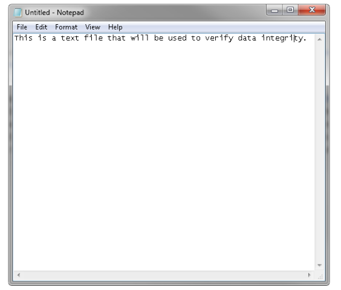
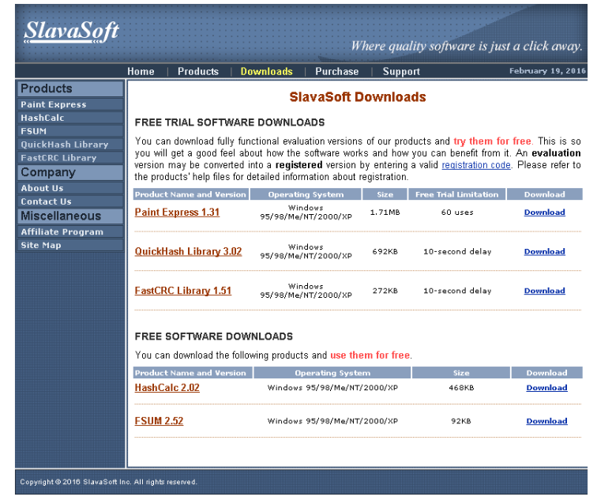
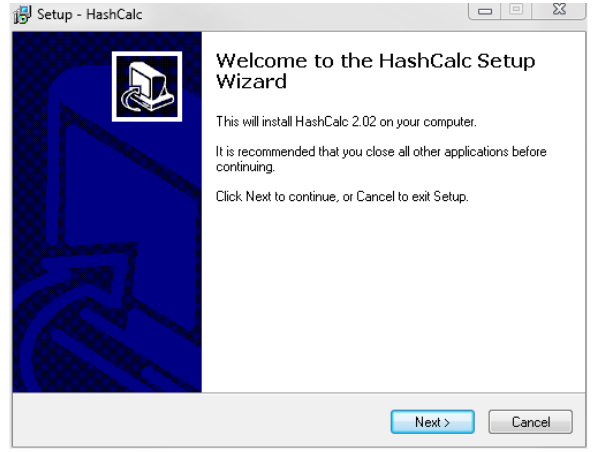
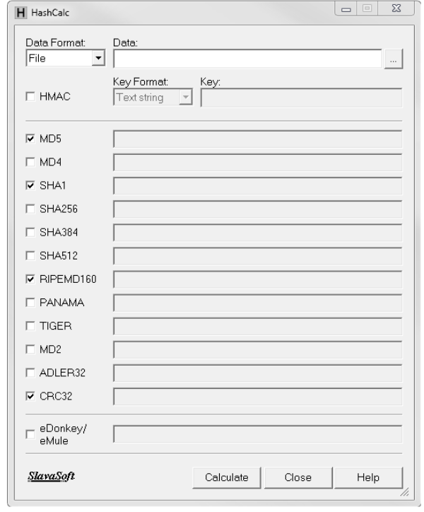

# Lab – Compare Data with a Hash

### Objectives 
Use a hashing program to verify the integrity of data.

### Background / Scenario
It is important to understand when data has been corrupted or it has been tampered with. 
A hashing program can be used to verify if data has changed, or if it has remained the same. 
A hashing program performs a hash function on data or a file, which returns a (usually much shorter) value. 
There are many different hash functions, some very simple and some very complex. 
When the same hash is performed on the same data, the value that is returned is always the same. 
If any change is performed on the data, the hash value returned will be different.

**Note**: You will need installation privileges and some knowledge of the process to install Windows programs. 
 
### Required Resources
* PC with Internet access

#### Step 1: Create a Text file 
a. Search your computer for the Notepad program and open it.                                                      
b. Type some text in the program.                                                                                 

c. Choose **File > Save**.                                                                                    
d. Navigate to **Desktop**.                                                                                     
e. Type **Hash** in the **File name**: field, and click **Save**.                                                      

#### Step 2: Install HashCalc
a. Open a web browser and navigate to http://www.slavasoft.com/download.htm.                                      

b. Click **Download** in the **HashCalc 2.02** row.                                                                                                                            
c. Open the **hashcalc.zip** file and run the **setup.exe** file inside.

d. Follow the installation wizard to install HashCalc.                                                                            
e. Click **Finish** on the last screen, and close the **README** file if it opened. You may read the file if you wish.                                                        
f. HashCalc is now installed and running.                                                                         

#### Step 3: Calculate a hash of the Hash.txt file  
a. Set the following items in HashCalc:
   1. Data Format: **File**. 
   1. Data: Click the ...button next to the Data field, navigate to the **Desktop** and choose the **Hash.txt** file.
   1. Uncheck **HMAC**. 
   1. Uncheck all hash types except **MD5**. 
                                                                  
b. Click the **Calculate** button. 

What is the value next to **MD5**?

#### Step 4: Make a change to the Hash.txt file
a. Navigate to the **Desktop** and open the **Hash.txt** file.                                                 
b. Make a minor change to the text, such as deleting a letter, or adding a space or period.                        
c. Click **File > Save**, and close **Notepad**.                                                                 

#### Step 5: Calculate a new hash of the Hash.txt file 
a. Click the **Calculate** button in HashCalc again.

	      What is the value next to MD5?

	      Is the value different from the value recorded in Step 3? 

b. Place a check mark next to all of the hash types.                                                              
c. Click **Calculate**.                                                                                             
d. Notice that many of the hash types create a hash of a different length. Why?                                                                        

